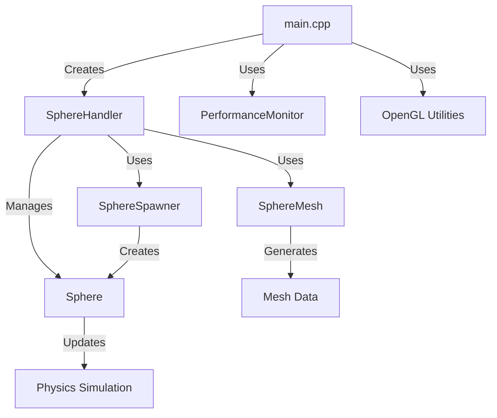
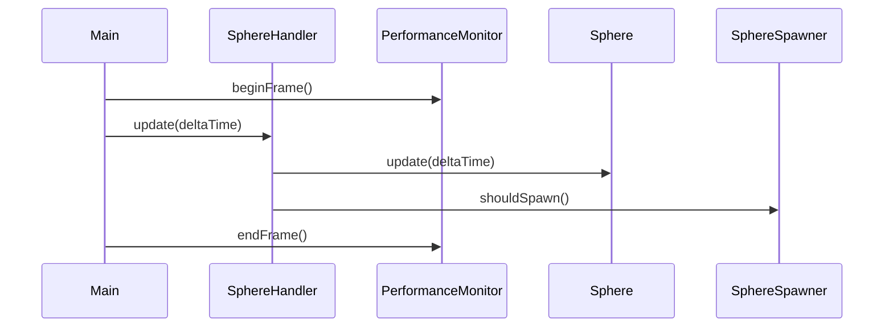

# Architecture Documentation

## System Overview



## Component Interactions

### Main Application Flow


## Memory Layout

```
+------------------------+
|      Shared Data      |
+------------------------+
| - Sphere Mesh         |
| - OpenGL Buffers      |
| - Shader Programs     |
+------------------------+
|    Dynamic Objects    |
+------------------------+
| - Sphere Instances    |
| - Performance History |
+------------------------+
```

## Data Flow

### Physics Update Cycle
1. Time Step Calculation
   ```cpp
   float deltaTime = currentTime - lastTime;
   ```

2. Physics Update
   ```cpp
   // For each sphere:
   velocity += gravity * deltaTime;
   position += velocity * deltaTime;
   handleCollisions();
   ```

3. Rendering
   ```cpp
   // For each sphere:
   model = translate(identity, position);
   draw(sphereMesh, model);
   ```

## Class Responsibilities

### SphereHandler
- Central coordinator
- Resource management
- Update orchestration
- Render preparation

### Sphere
- Position tracking
- Velocity updates
- Collision response
- State management

### SphereMesh
- Vertex generation
- Index calculation
- Buffer management
- Mesh optimization

### SphereSpawner
- Timing control
- Position randomization
- Instance creation
- Spawn rate management

## Performance Considerations

### Memory Management
```cpp
// Shared resources (static)
- Vertex buffer:   sectors * stacks * sizeof(vec3)
- Index buffer:    triangles * 3 * sizeof(uint)
- Shader program:  ~1KB

// Per-instance data (dynamic)
- Position:        sizeof(vec3)
- Velocity:        sizeof(vec3)
- Color:          sizeof(vec3)
```

### CPU Optimization
1. Physics Updates
   - Independent calculations
   - Cache-friendly data layout
   - Vectorization opportunities

2. Collision Detection
   - Spatial partitioning ready
   - Early-out checks
   - Minimal branching

### GPU Optimization
1. Render State Management
   - Minimal state changes
   - Batched rendering
   - Shared resources

2. Buffer Management
   - Static data in VRAM
   - Efficient updates
   - Instance rendering ready

## Extension Points

### Adding New Features
1. Sphere-to-Sphere Collisions
   ```cpp
   class SpatialGrid {
       void insert(Sphere* sphere);
       std::vector<Sphere*> getNeighbors(const vec3& pos);
   };
   ```

2. Custom Physics Properties
   ```cpp
   struct PhysicsProperties {
       float mass;
       float restitution;
       float friction;
   };
   ```

3. Visual Effects
   ```cpp
   struct MaterialProperties {
       vec3 ambient;
       vec3 diffuse;
       vec3 specular;
       float shininess;
   };
   ```

## Error Handling

### OpenGL Errors
```cpp
void GLAPIENTRY debugCallback(
    GLenum source, GLenum type, GLuint id,
    GLenum severity, GLsizei length,
    const GLchar* message, const void* userParam
);
```

### Physics Validation
```cpp
bool validateState(const Sphere& sphere) {
    // Check position bounds
    // Verify velocity limits
    // Validate energy conservation
}
```

## Configuration System

### Physics Constants
```cpp
namespace PhysicsConfig {
    constexpr float GRAVITY = 9.81f;
    constexpr float MAX_VELOCITY = 100.0f;
    constexpr float MIN_BOUNCE = 0.1f;
}
```

### Render Settings
```cpp
namespace RenderConfig {
    constexpr int SPHERE_SECTORS = 16;
    constexpr int SPHERE_STACKS = 16;
    constexpr float FOV = 45.0f;
}
```

## Future Considerations

### Parallelization
- Physics updates
- Collision detection
- Instanced rendering

### Advanced Features
- Particle effects
- Shadow mapping
- Post-processing

### Optimization Opportunities
- SIMD physics
- Compute shaders
- Occlusion culling 