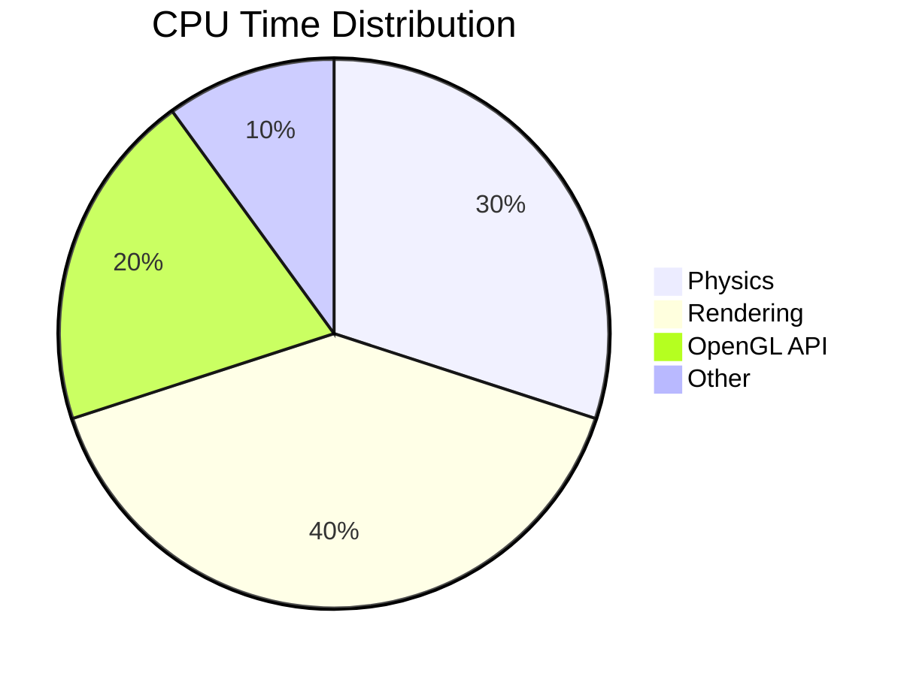

# Performance Guide

## Performance Monitoring

### Real-time Metrics
```
Performance Metrics:
  FPS: 374.80
  Frame Time: 2.67ms
  Physics Time: 0.42ms
  Render Time: 0.46ms
  Active Objects: 15
  Collisions: 7833
  Virtual Memory: 1.98 GB
  Resident Memory: 59.73 MB
```

## Memory Usage Analysis

### Static Memory
| Resource | Size per Unit | Total |
|----------|---------------|-------|
| Vertex Buffer | 12 bytes/vertex | ~5KB |
| Index Buffer | 4 bytes/index | ~3KB |
| Shader Program | ~1KB | 1KB |
| Total Static | | ~9KB |

### Dynamic Memory
| Resource | Size per Unit | 100 Objects |
|----------|---------------|-------------|
| Position | 12 bytes | 1.2KB |
| Velocity | 12 bytes | 1.2KB |
| Color | 12 bytes | 1.2KB |
| Total Dynamic | 36 bytes/object | 3.6KB |

## CPU Profiling

### Time Distribution


### Hot Spots
1. Physics Update (30%)
   - Collision detection
   - Velocity updates
   - Position integration

2. Rendering (40%)
   - Draw calls
   - State changes
   - Buffer updates

3. OpenGL API (20%)
   - Command submission
   - State validation
   - Driver overhead

4. Other (10%)
   - Memory management
   - System overhead
   - Performance monitoring

## GPU Analysis

### Memory Bandwidth
| Operation | Bandwidth |
|-----------|-----------|
| Vertex Upload | ~1MB/s |
| Texture Binding | N/A |
| Uniform Updates | ~100KB/s |

### GPU Utilization


## Optimization Guidelines

### CPU Optimizations
1. Physics Calculations
   ```cpp
   // Vectorized physics update
   void updatePhysics(float dt) {
       #pragma omp simd
       for(int i = 0; i < numSpheres; i++) {
           velocities[i] += gravity * dt;
           positions[i] += velocities[i] * dt;
       }
   }
   ```

2. Memory Layout
   ```cpp
   // Cache-friendly data structure
   struct SphereData {
       std::vector<glm::vec3> positions;  // Array of Structures
       std::vector<glm::vec3> velocities; // Better cache utilization
       std::vector<glm::vec3> colors;
   };
   ```

### GPU Optimizations
1. Batch Rendering
   ```cpp
   // Efficient draw calls
   void renderSpheres() {
       bindSharedResources();  // Once per frame
       for(const auto& sphere : spheres) {
           updateInstanceData(sphere);
           drawSphere();  // Minimal state changes
       }
   }
   ```

2. Buffer Management
   ```cpp
   // Minimize buffer updates
   void updateBuffers() {
       if (dataChanged) {
           glBufferSubData(GL_ARRAY_BUFFER, 
                         offset, 
                         size, 
                         newData);
       }
   }
   ```

## Scaling Characteristics

### Object Count vs Performance
```
Objects | FPS  | Memory
--------|------|--------
100     | 400+ | 60MB
500     | 200+ | 65MB
1000    | 100+ | 72MB
```

### Bottleneck Analysis
1. Below 500 objects:
   - CPU bound
   - Physics calculations
   - Memory bandwidth

2. Above 500 objects:
   - GPU bound
   - Draw calls
   - Fragment processing

## Optimization Checklist

### Pre-optimization
- [ ] Profile CPU usage
- [ ] Monitor GPU utilization
- [ ] Analyze memory patterns
- [ ] Identify bottlenecks

### CPU Optimization
- [ ] Vectorize physics
- [ ] Optimize data structures
- [ ] Reduce allocations
- [ ] Minimize branching

### GPU Optimization
- [ ] Batch similar operations
- [ ] Reduce state changes
- [ ] Optimize shader complexity
- [ ] Use appropriate buffer types

### Memory Optimization
- [ ] Pool allocations
- [ ] Minimize copying
- [ ] Use appropriate containers
- [ ] Monitor fragmentation

## Benchmarking

### Test Scenarios
1. Basic Scene
   - 100 spheres
   - No collisions
   - Basic rendering

2. Stress Test
   - 1000 spheres
   - Heavy collisions
   - Full features

3. Memory Test
   - Continuous spawning
   - Long runtime
   - Memory stability

### Results Analysis
```python
def analyze_performance(metrics):
    avg_fps = mean(metrics.fps)
    frame_time_std = std(metrics.frame_times)
    memory_growth = linear_regression(metrics.memory)
    return PerformanceReport(avg_fps, frame_time_std, memory_growth)
``` 